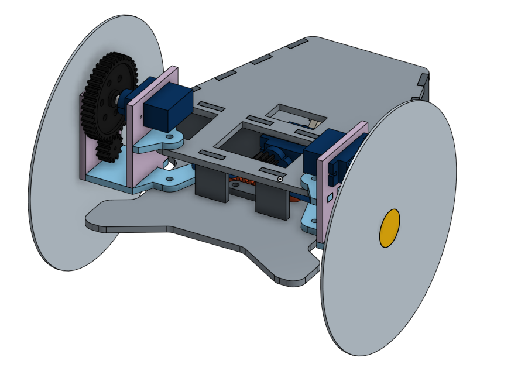

# Robot Design

# Overview

In my freshman year of high school, all students finished the year by
completing an engineering project: we had to construct a functioning
wheeled robot with a limited set of basic resources. We had access to
a single sheet of plywood laser cut to our specification, blank
compact discs for wheels, three small servo motors, plastic gears, and
various small electronic components. Each robot was to be controlled
by an Arduino microcontroller.

Most of the effort I exerted as part of this project was in physically
designing the robot, a task I undertook using the Onshape computer
aided design (CAD) program. My goal was to completely construct the
robot virtually and understand how every part would fit together,
including the motors and gears. I even included a rack and pinion
steering system, which was intended to provide better control than
tank steering with the exceedingly narrow wheels.

# Project Goals

-   Complete a primarily self directed, multidisciplinary engineering
    project
-   Fulfill a specific set of product requirements while working under
    constraints
-   Demonstrate ability with computer aided design, programming, and
    basic electronics
-   Build a small robot that can travel a certain distance and partially
    navigate a maze
-   Write code for an Arduino mounted on the robot, to navigate with
    servo motors

# Design

The main directory of this repository contains several images of my
final robot design, as well as a couple images of the finished
robot. Our list of available materials was limited. I had to work to
fit all of the pieces of my robot's structure on a single sheet of
plywood, eighteen inches square, from which they were laser cut. Most
of these pieces were edged with rectangular cutouts so that they could
be assembled at right angles, forming box joints.

One of my novel design decisions was to include an independent
steering system in the robot. This was a rack and pinion model, with a
servo pulling the front wheel mounts to any angle from about positive
15 degrees to negative 15 degrees. In fact, I designed my own rack
gear part to interface with the steering servo and had it 3D
printed. I ran several tests of this steering system after
constructing the robot, and it worked as intended.

Speed was a goal of mine in this design, which required some extra
effort due to the extremely slow rotation speed of small servo
motors. I placed a small gearing in each wheel mount, connecting the
servo to the wheel hub. Such a gearing does reduce available torque;
on the other hand, it increases the wheel rotation speed and thus the
speed of the robot. Upon assembling the robot, I also wrapped the
wheel rims in rubber to improve traction.

Unfortunately, I was not able to complete a program to navigate a maze
before the project was due. I did, though, write C++ code for the
Arduino to test the steering system, and another program to run a
predetermined course and then move partially through a maze. If I had
spent more time on my robot, I would have added sensors to its
exterior and connected them to the Arduino controller. I could then
improve the robot's software with those additional resources.

